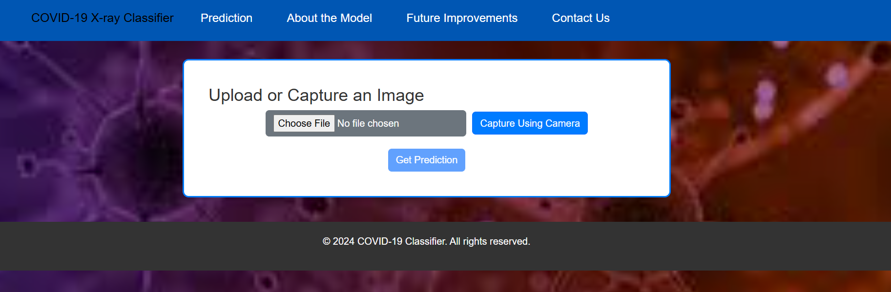
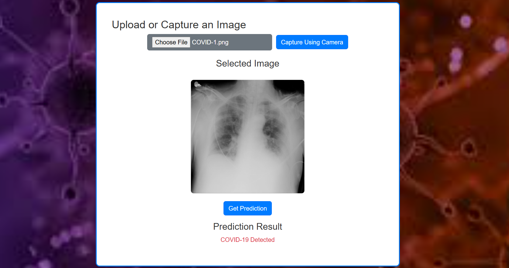
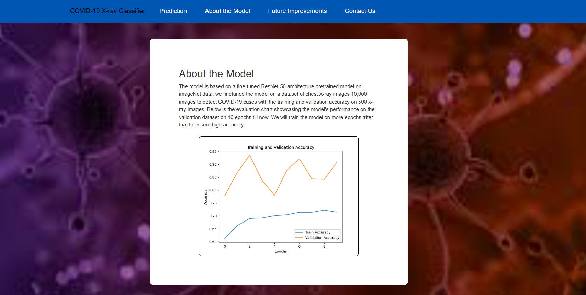
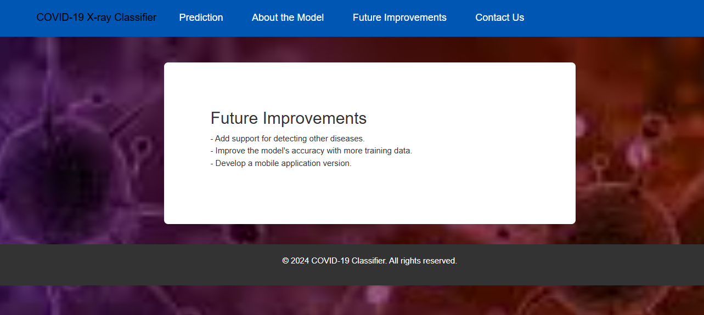
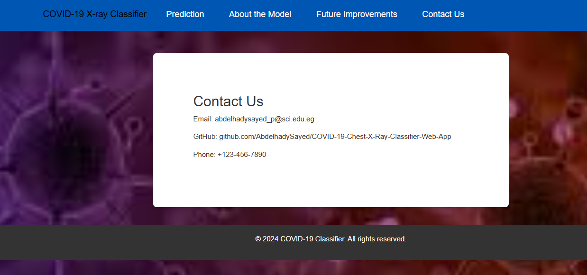

# COVID-19 Chest X-Ray Classifier Web App

This web application enables users to upload or capture chest X-ray images to determine whether the image shows signs of COVID-19. Built with React for the frontend and Flask for the backend, the app integrates a deep learning model to perform medical image analysis. The backend now includes database functionality using SQLite to store information about the app, including descriptions and future improvements.

### Features:
- **Upload or Capture X-Ray Images**: Upload a chest X-ray image from your device or capture it using your camera.
- **Real-time Prediction**: Get real-time predictions on whether the X-ray shows signs of COVID-19.
- **Database-Backed Information**: The app stores and retrieves general information about the app, the model, and future improvements from an SQLite database.
- **User-Friendly Interface**: A clean and easy-to-use interface for seamless interaction.

### Installation:
The repository contains both the frontend (React) and backend (Flask) components. Below are the steps to set up both parts and run the app locally.

#### 1. Prerequisites:
Ensure you have the following installed:
- **Node.js** (v16 or higher)
- **npm** (comes with Node.js)
- **Python** (v3.7 or higher)
- **SQLite** for the database.

#### 2. Clone the Repository:
```bash
git clone https://github.com/abdelhadysayed/covid-xray-classifier.git
cd covid-xray-classifier
```

#### 3. Install Frontend Dependencies:
Navigate to the `frontend` folder and install the dependencies:
```bash
cd frontend
npm install
```

#### 4. Install Backend Dependencies:
Navigate to the `backend` folder and install the dependencies:
```bash
cd backend
pip install -r requirements.txt
```

#### 5. Set Up the Database:
The database is automatically created and configured using SQLAlchemy. To initialize the database and tables, run the following in the backend folder:
```bash
python
>>> from app import db
>>> db.create_all()
```

#### 6. Start the Backend:
Run the Flask backend:
```bash
cd backend
python app.py
```

#### 7. Start the Frontend:
Run the React frontend:
```bash
cd frontend
npm start
```

#### 8. Access the Web App:
Open your browser and navigate to:
```
http://localhost:3000
```

### How to Use:
1. **Upload or Capture an Image**:
   - Use the **Upload Image** button to select a chest X-ray image from your device.
   - Alternatively, click **Capture Using Camera** to take a photo using your webcam or device camera.

2. **View the Prediction**:
   - After uploading or capturing an image, click the **Get Prediction** button to analyze the image.
   - The result will display whether the X-ray indicates COVID-19 or normal lungs.

3. **View Information**:
   - Access app details, the model used, evaluation metrics, and planned future improvements from the **About**, **Future**, and **Contact** sections.

### Demo:
Here are some screenshots of the web app in action:

#### Upload and Capture Interface:


#### Prediction Result:


#### About the model page to show model info and evaluation chart:


#### Future improvement page:


#### Contact us page:



### Routes:
- **/about**: Provides details about the model, dataset, and performance metrics.
- **/future**: Displays planned improvements.
- **/contact**: Contact information for support.
- **/predict**: Submit an X-ray image for classification.
- **/evaluation_chart**: Access the evaluation chart of the model.
- **/update_info**: Update app description in the database.

### Known Limitations:
- **Model Accuracy**: The model is still under development. We are working to improve accuracy with more data and better training techniques.
- **Non-Chest X-Ray Images**: The model is specifically trained on chest X-rays. Uploading non-medical or non-chest X-ray images will likely produce incorrect results.
- **Database Limitations**: The app currently only stores basic information such as app descriptions and planned improvements.

### Future Improvements:
- **Model Accuracy**: Improve classification accuracy by refining the training process and expanding the dataset.
- **Database Expansion**: Add more features to the database, such as storing user-uploaded images and prediction results.
- **Additional Support**: Enable the app to handle more types of medical imaging (e.g., CT scans and MRIs).
- **Real-Time Predictions**: Enhance the model for real-time prediction integration with mobile applications.

### Contributing:
Contributions are welcome! To contribute, fork the repository, make your changes, and submit a pull request. Ensure that your contributions align with the following steps:
1. Clone the repository.
2. Create a new branch for your feature or bugfix.
3. Commit your changes and push them to your forked repository.
4. Open a pull request to the `main` branch.

### Contact:
For any questions or suggestions, feel free to reach out:
- **Email**: abdelhadysayed_p@sci.asu.edu.com
- **GitHub**: [Abdelhady Sayed](https://github.com/AbdelhadySayed)
